## 1日目
### 開発環境のセットアップ
 - macOS用の開発環境の準備
 - sandaiさんがmacOS用の開発環境をGitHubに公開されているのでこれをベースに作成
   - git cloneしたレポジトリのbin/install.shを環境に合わせて改変する。
   - Q.appは使わないのでMakefileとinstall.shをそれに併せて修正

```sh
$ git clone https://github.com/sandai/30nichideosjisaku 
$ cd 30nichideosjisaku/bin
$ sh install.sh
```

 - 必要なツールをhomebrewでインストール
```sh
$ brew cask install 0xED
$ brew install qemu
```
### helloos0の作成
 - バイナリエディタの0xEDでべた書きする
  - bzと違い垂直方向の番地が異なるので合わせる
```sh
 $ make run
```

### helloos1の作成
- さすがにDBで書くのは面倒だったので、サポートディスクのデータをコピーして実行

### helloos2の作成
- hellos2のバージョンは、まともな記述になっているのでこれは実際に写経した。


## 2日目
### テキストエディタの紹介
 - テラパッドが紹介されているが、VS Codeを利用しているのでスキップ。

### さて開発再開
- 1日目で作成したhelloos3の`helloos.nas`をもう少しアセンブリっぽく書き直す。

- アセンブリの命令である、`MOV`,`JMP`, `JE`, `CMP`等の説明。アセンブリ命令については省略する。

- 8bit, 16bit, 32bitレジスタの紹介
  - レジスタは基本的にどれを利用しても同じように計算が可能だが、用途に合わせてレジスタを選択すると効率のよい記述ができる。

**16bitレジスタ**
|レジスタ|名称|
|:----|:----|
|AX|Accumlator|
|CX|Counter|
|DX|Data|
|BX|Base|
|SP|StackPointer|
|BP|BasePointer|
|SI|SourceIndex|
|DI|DestinationIndex|

**8bitレジスタ**
|レジスタ|名称||
|:----|:----|:----|
|AL|AccumlatorLow|AXの下位8bit|
|CL|CounterLow|CXの下位8bit|
|DL|DataLow|DXの下位8bit|
|AH|AccumlatorHigh|AXの上位8bit|
|CH|CounterHigh|CXの上位8bit|
|DH|DataHigh|DXの上位98it|

**32bitレジスタ**
- EAX, ECX, EDX, EBX, ESP, EBP, ESI, EDI
- 32ビットレジスタはたとえばEAXは下位16bitがAXそのもの。ほかも同様
- 上下に分割できるが、上位16bitにはレジスタ番号がないためそのままでは利用できない。

### ブートセクタが作れるように整理
- helloos3の内容をコピーし、ブートセクタ以外の部分のところを削除して、ブートセクタのみ作成するように`helloos.nas`を修正する
- ついでに`Makefile`も修正


### 今後のためのMakefile導入
- Makefileを拡充して`helloos5`を作成

## 3日目
### さぁ本当のIPLを作ろう
- harib00a
- ブートローダーの構築 

新出命令 __JC__ キャリーフラグが1である時にジャンプする。
- [OSDEV](http://oswiki.osask.jp/)
- フロッピーディスクの構造の説明

### エラーになったらやり直そう
- harib00b
- habi00aにリトライ処理を追加

### 18セクタまで読んでみる
- harib00c
- habi00bに18セクター先までの読み込み処理を追加

### 10シリンダ分読み込み
- harib00d
- habi00cに10シリンダー分の読み込み処理を追加

### OS本体の書き込み
- harib00e
- habi00dからOSとなる部分を新規に作成し、haribote.imgのディスクイメージに保存する

### ブートセクタからOS本体を起動させてみる
- harib00f
- habi00eを修正し、ipl.nasの最後の処理に0xc200番地へジャンプする処理を追加
  - ディスクイメージの開始アドレスが0x004200でブートセクターの先頭アドレスが0x8000のため0x4200+0x8000=0xc200 であるので

### OS本体の動作を確認してみる

- harib00g

- harib00eで作成したOSイメージに対して、画面モードの切り替えを実装

- ビデオモード設定は以下の通り

  - AH=0x00

  - AL=モード

    - 0x13　VGAグラフィックス 320x200x8bitカラー　バックドピクセル

- 画面が真っ黒になったのでOK

### 32ビットモードへの準備 

- harib00h

- ブート関連の情報として以下の情報を定数に追加（後々使うっぽい）

  - 色数
  - 横方向の解像度
  - 縦方向の解像度
  - グラフィックバッファの開始位置

- キーボードのLED情報を取得する

  

### ついにC言語導入へ

- haribo00i

- この章の山場だと思う

- `bootpack.c`を新規作成しOSのエントリポイントとする

  - HariMainがエントリとなる（gocc1の仕様？）

- 以下の手順でCのソースからコンパイルする

  - `gocc1`を使って、`bootpack.c`から`bootpack.gas`を生成する
  - `gas2nask`を使って、`bootpack.gas`を`bootpack.nas`に変換する
  - `bootpack.nas`を`nask`でコンパイルし、`bootpack.obj`を生成する
  - `obj2bim`を使って、`bootkpack.obj`から`bootpack.bim`を生成する
  - 最後に`bim2hrb`を使って、`bootpack.bim`から`bootpack.hrb`を生成する
  - 生成した`bootpack.hrb`と`asmhead.bin`をcatコマンドで連結させて `haribote.sys`を作成する

- 上記の手順が踏めるように、`Makefile`をゴリゴリ修正した

- 以前と同じように画面真っ黒になったのでOK

  

### とにかくHLTがしたい

- harib00j
- HLTの関数をアセンブリで記述し、gocc1のコンパイラにリンクするのみ

​      
## 4日目
### C言語からメモリを書き込みたい
- harib01a
- アセンブラーでVRAMの番地に書き込む命令write_mem8を実装する。
  - 実際にはC言語でもポインターを使えば実現できるので実装する必要はないのだが、本に沿って進める。
- 命令セットが486系であることを示すために、`INSTRSET`命令を追加

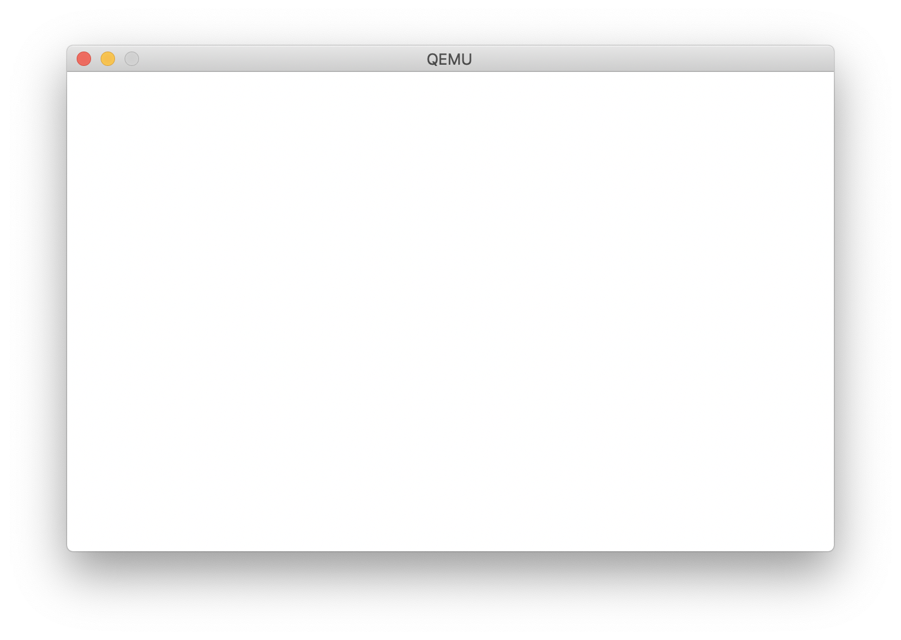

#### しましま模様

- ビット論理積演算をつかう

- 実行結果

  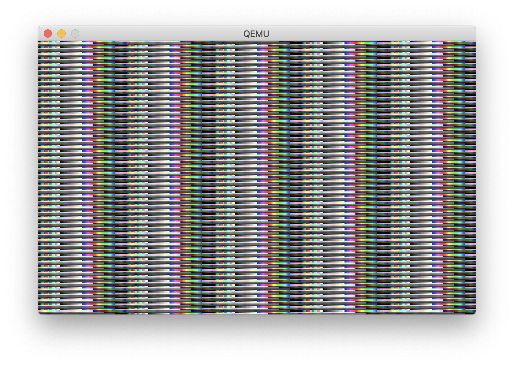

#### ポインタに挑戦

- harib01bの内容をポインタを使った書き方に書き直す

- これにあわせて、`naskfunc.nas`から`write_mem8`関数を削除

- 実行結果は、harib01bと同じなので割愛

  

#### ポインタの応用（１）

- harib01cの内容をC言語の別の構文で書き換えるだけ
- 実行結果はharib01bと同じなので割愛


#### ポインタの応用（２）

- habi01cの内容をC言語の別の構文で書き換えるだけ
- 実行結果はharib01bと同じなので割愛


#### 色番号設定

- 現在使用している320x200の8bitカラーモードは、8bitしか使用できない。

- この8bitの色番号に対応する色はプログラマで自由に決めてよい

  - 色番号と色を対応づけたものを__パレット__と呼ぶ

- ビデオDAコンバータのカラーパレットへのアクセス手順からカラーパレットの初期化と設定を行う

- 新出命令

  - `CLI`命令は、__Clear Interrupt Flag__で割り込みフラグをリセットする
  - `STI`命令は、__Set Interrupt Flag__で割り込みフラグをセットする
  - `PUSHFD`は、__Push Flag Double-Word__でフラグをDoubleWordでプッシュする
  - `POPHFD`は、__POP Flag Double-Word__でフラグをDoubleWordでポップする

  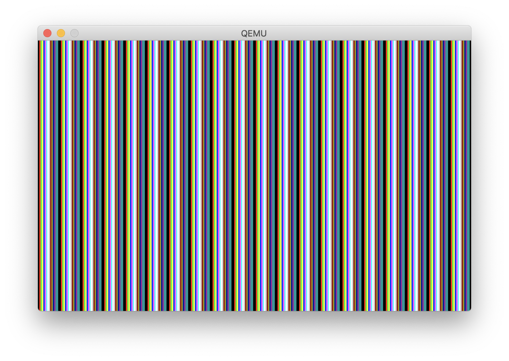

  #### 四角形を描く
  
  - VRAMに矩形を書き込む計算は`OxaOOOO+x+y*320`
  
    - 0xa0000は開始番地で、y軸のサイズだけ異なるが基本的には同じ
  
  - VRAMに矩形を描画する関数`boxfill8`を`bootpack.c`に追加してビルド
  
  - 以下のようになった
  
    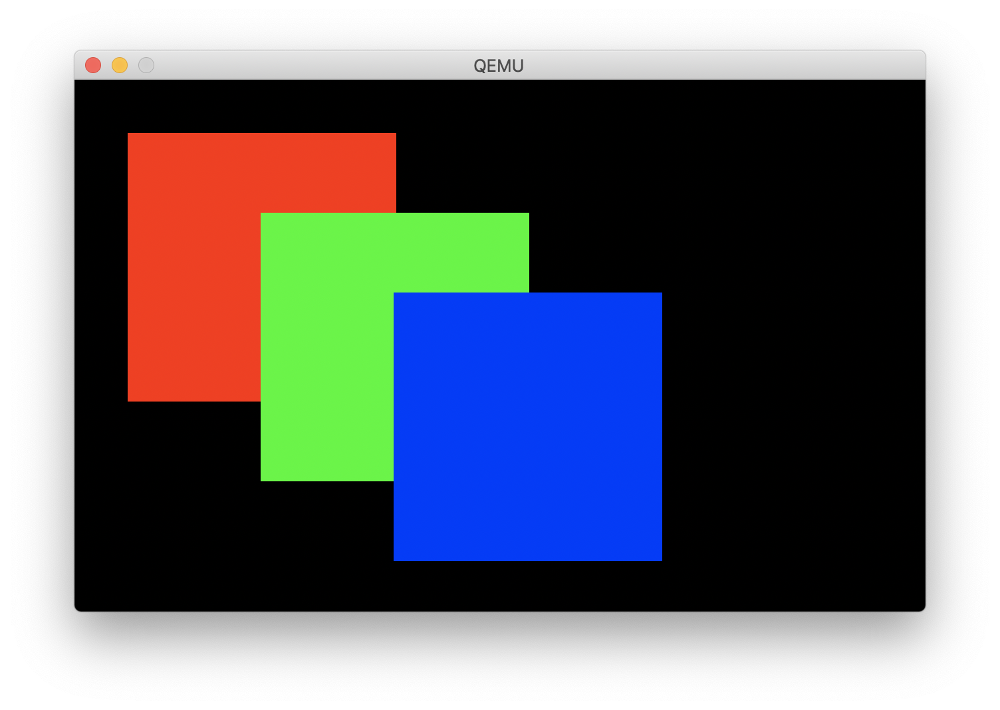

#### 今日の仕上げ

- boxfillの呼び出しを少し調整し、Windowsのタスクバーっぽい表示に調整

  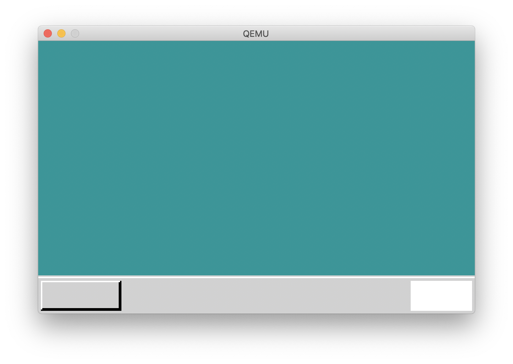

### 5日目 構造体と文字表示とGDT/IDT初期化

#### 起動情報の受け取り

- VRAMの位置情報と、スクリーンサイズをbootinfoから取得するように修正
- 画面は、harib01hと同じのため省略


#### 構造体を使ってみる

- 起動情報の受け取り方を構造体に変更
  - アロー演算子の記法は使わない実装
- 画面は、harib01hと同じのため省略


#### 矢印表記を使ってみる

- 構造体への変数アクセスをアロー演算子に書き換えて実装
- 画面は、harib01hと同じのため省略


#### とにかく文字を出したい
- harib02d
- harib02cで作成した画面表示をinit_screen関数として関数に切り出し
- フォントを表示する関数`putfont8`関数を作成
- 本筋と外れるが、macOS 10.15に更新してしまったので、32bitアプリケーションが動かなくなってしまった。
   - nask, gocc1, edimageが使えなくなった。
   - [『30日でできる！OS自作入門』を macOS Catalina で実行する](https://qiita.com/noanoa07/items/8828c37c2e286522c7ee)を参照して、一般的なアプリケーションを用いて再構築した。
      - brewを使ってnasmとmtools、i386-elf-gccをインストール
      - 上記の記事とツールを提供してくれた人に感謝
```sh
$brew install nasm
$brew install mtools
```

   - 標準のHomebrewの環境では、i386-elf-gccの代わりに、x86_64-elf-gccが提供されているが、これを用いてリンクとコンパイルを実行するとエラーが発生する。

```sh
❯ make
make -r img
make -r haribote.img
x86_64-elf-gcc -march=i486 -m32 -nostdlib -T hrb.ld -g bootpack.c naskfunc.o -o bootpack.hrb
/usr/local/opt/x86_64-elf-binutils/bin/x86_64-elf-ld: i386 architecture of input file `/var/folders/z0/45fcm1sj5ll87b57m00xgb4w0000gn/T//ccYaGdlV.o' is incompatible with i386:x86-64 output
/usr/local/opt/x86_64-elf-binutils/bin/x86_64-elf-ld: i386 architecture of input file `naskfunc.o' is incompatible with i386:x86-64 output
collect2: error: ld returned 1 exit status
make[2]: *** [bootpack.hrb] Error 1
make[1]: *** [img] Error 2
make: *** [default] Error 2
```
  - なので、[StakcOverflowの記事](https://stackoverflow.com/questions/40655204/cant-brew-install-gcci386-elf-gcc)を参考に、brew tapして、i386-elf-gccをインストールする

```sh
$brew tap nativeos/si386-elf-toolchain 
$brew install i386-elf-binutils i386-elf-gcc
```

 - これでビルドすると次の結果が得られる。
 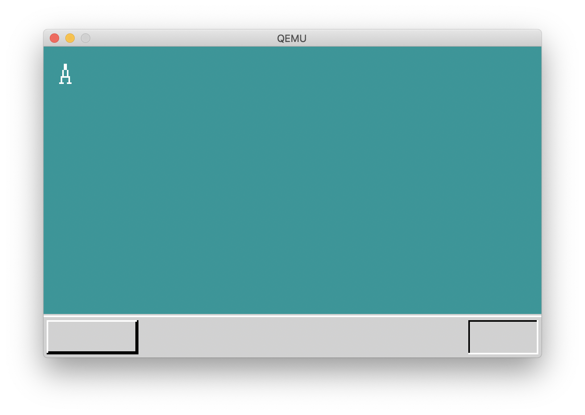

#### フォントを増やしたい
- harib02e
- OSASKのサイトからフォント作成のプログラムがWikiに提供されていたので、これをコンパイルして`makefont`を作成
- 作成したmakefontプログラムと`hankaku.txt`からバイナリデータを生成した。
- 生成したバイナリデータは`binutils`に含まれている`objcopy`を使ってobjファイルに変換し、変換したobjファイルをbootpack.cのオブジェクトファイルとリンクすることで、fontデータの埋め込みを行った。
    - binutils/objcopyの使い方は以下の記事を参考にした。
    - [普通のやつらの下を行け: objcopy で実行ファイルにデータを埋め込む](http://0xcc.net/blog/archives/000076.html)
- 実行結果は以下の通り
  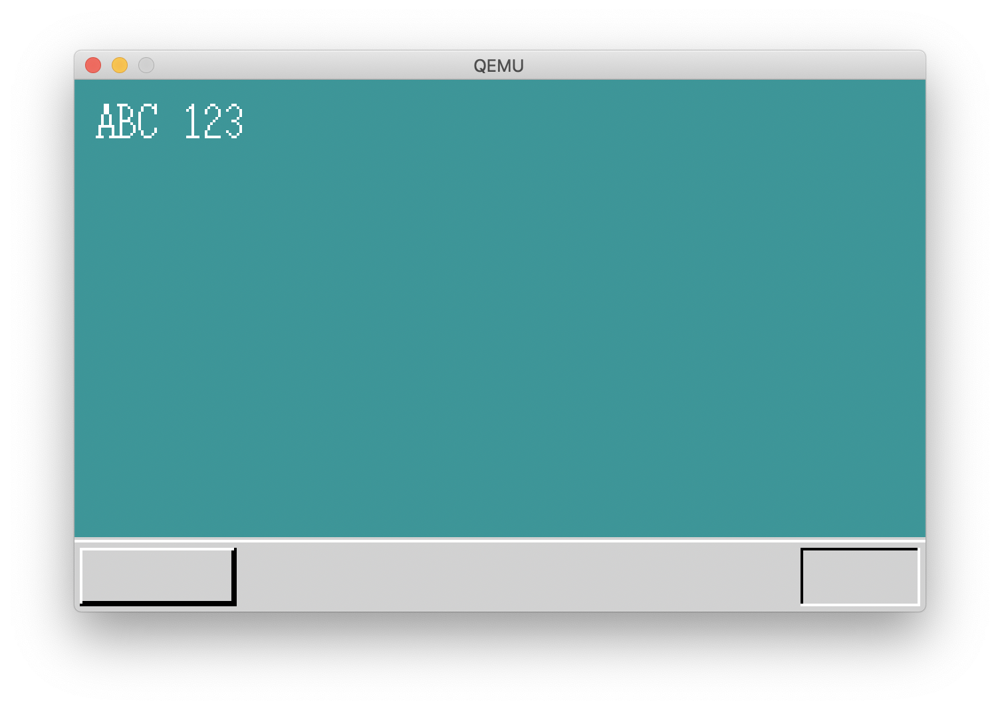


#### 文字列を表示したい
- harib02f
- harib02eで作成した文字表示の部分をまとめて、文字列を表示する関数`putfont8_asc`を記述するのみ
- 実行結果は、前回と同様のなので省略する

#### 変数の値の表示
- harib02g
- `sprintf`で作成した文字列を、先に作った`putfont8_asc`に渡すだけ・・のはずだが、macOS上で`i386-elf-gcc`を使ってクロスコンパイルしているせいか、リンク時に`crt0.o`がないとエラーメッセージと`-lc`が見つからないエラーが表示される。
  - [このあたり](http://www.ertl.jp/~takayuki/readings/c/no03.html)を参考にすると`crt0.o`自体はmainを呼び出すためのもののよう
  - 同様に`-lc`が見つからないのもlibcがないからと思われる（ビルドしてないし）
  - なので、`crt0.c`を自作してlibcをビルドしてリンクすれば動くと思われるが、必要なのはsprintfだけなので今回は[ここの記事のコード](http://bttb.s1.valueserver.jp/wordpress/blog/2017/12/17/makeos-5-2/)を拝借させいていただいた
  - 今後困ることも考えられるので、また環境を再構築した方がいいかもしれない。
- 実行結果は次の通り

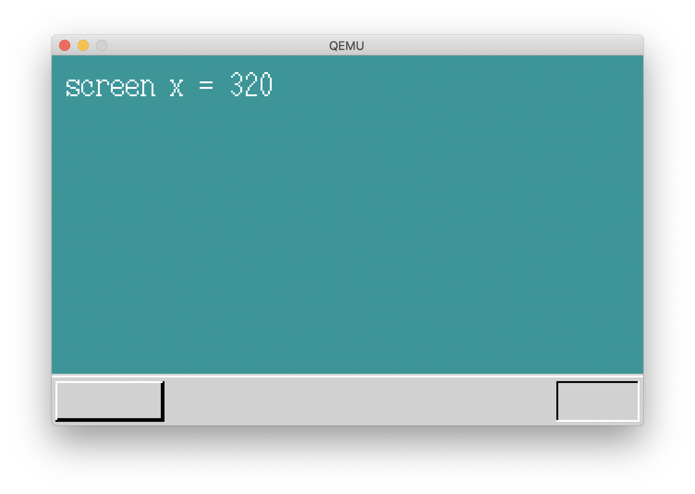

#### マウスカーソルも描いてみよう
- harib02h
- マウスカーソルを初期化する`init_mouse_cursor8`関数と矩形を描画する`putblock8_8`関数を実装する
- `HariMain`の実装を`init_mouse_cursor8`と`putblock8_8`に書き換える
- ここまで出来ると次の結果が得られる。

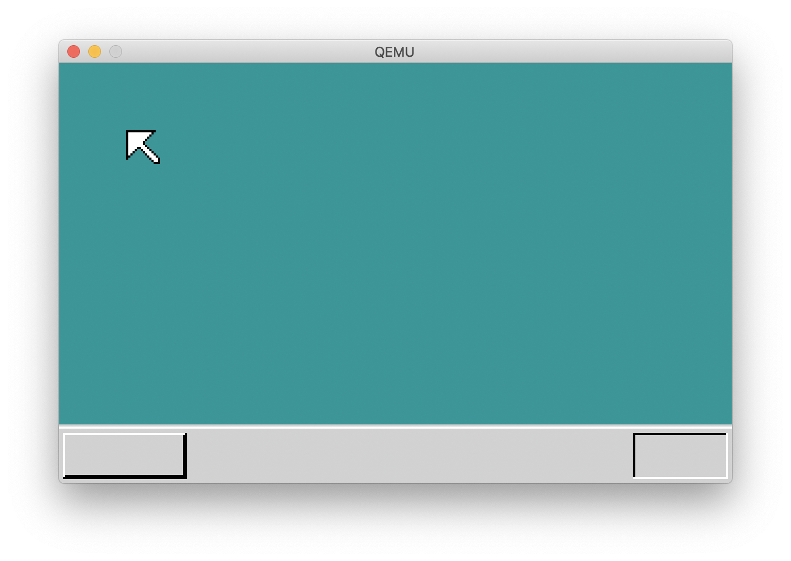

#### GDTとIDTを初期化しよう
- harib02i
- マウス（外部装置）を利用するためにGDTとIDTを初期化する処理を追加する
- 割り込み処理とセグメントについては、既知の内容だが復習のために整理しておく
- セグメンテーションとは、メモリの利用範囲が競合しないための仕組み
  - メモリを適当に切り分けて、それぞれのブロックの先頭番地を0として扱える。
  - この切り分けたブロックを「セグメント」と呼ぶ
  - 同様のことはページングで実現できるが、この本ではページングについては取り扱わない
  - セグメントを1つ表すのには、以下の情報が必要になる。
    1. セグメントの大きさ
    1. セグメントの開始番地
    1. セグメントの管理属性
- 割り込み処理とは、外部装置の状況（外部割り込み）や内部のトラブル（内部割り込み）などが発生すると、処理を切り替える機能
  - 割り込みが発生すると、CPUは実行中の処理を一時中断し、再開できるように準備して、割り込みごとに設定された処理を呼び出す
- GDT(Global segment Descriptor Table)
  - セグメントの情報が記述されたテーブル
  - これの番地をGDTR(Global segment Descriptor Table Register)に設定する
- IDT(Interupt Descriptor Table)
  - 割り込み番号とそれに対応する処理を記述したテーブル  
- 以上を踏まえて、GDTとIDTの初期化処理を組み込み
- 実行結果は前回と同様なので省略


## 6日目 分割コンパイルと割り込み処理
### ソースファイル分割
- harib03a-harib03c
  - harib03~harib03cまでは一気にする。
  - ソースファイルを分割するだけなので
- 5日目harib02iを作ったまでの段階の`bootpack.c`を分割する
    - graphics.c
      - 画像処理関係のコード
    - descriptor_table.c
      - GDT・IDT関係のディスクリプターテーブルに関係するコード
    - bootpack.c
      - 上記以外
- ついでに、コメントをつけて、`Makefile`に一般規則を導入して修正する
   - `Makefile`の修正はharib03bなのだがここで一緒にやっても問題ないだろう
- ソースコードを`.h`と`.c`に分割する
  - これはharib03cの内容だが、分割する以上まとめてやった方がよいと判断
- 次はnascfuncを整理しよう

### やり残した説明
- `load_gdtr`について
  - 指定されたリミットと番地を`GDTR`という48ビットのレジスタに代入するためのもの
  - 特別なレジスタのためMOV命令では書き込めない
  - 代入の際には、番地を指定してそこから6バイト(48ビット)を読み取りGDTRレジスタに代入する`LGDT`命令を使う
  - `LIDT`も同じ
- セグメント情報の書き込みについて
  - CPUの仕様に沿って、8バイトにまとめて書き込む関数
    - セグメントの大きさ、セグメントの番地、セグメントの管理属性
  - セグメントの番地情報は32bitで表現される
    - ビット演算を活用して下位16bit中位8bit上位8bitに分割して代入をしている
    - これは80286時代のCPUとの互換性のため
  - セグメントの大きさ(リミット)は20bitで表現される
    - 32ビットすべてリミットを使ってしまうと、管理属性が書き込めなくなるため、20bitになっている
    - そのままでは4GBの大きさのセグメントを表現できないが管理属性にGビットを使うことでリミットをページ単位として扱えるように出来る
      - これで4KBx1M=4GBが使える
  - 残る12ビットがセグメントの管理属性
    - limit_highの上位4ビットにいれる関係でarは16ビットの構成になっている
    - arの上位4bitは「GD00」という構成になっていて
      - Gは先に出てきたGビット
      - Dはセグメントモード
        - 0は16bit
        - 1は32bit
      - なお16ビットモードは80286との互換性のために存在しているもので、通常使用することはない
    - 下位8bitは、大きくわけてシステム専用の読み書き領域・システム専用の実行領域・アプリケーション専用の読み書き領域・アプリケーション専用の実行領域・未使用のdescriptor tableとなっている
      - 具体的なビット列については省略する
    - システムとアプリケーションでモードが異なる

### PIC初期化
- harib03d
- PIC(Programable Interrupt Controller)の初期化処理を行う
  - マウスなどの外部装置を使うために必要
- PICは8この割り込み信号を1つの信号にまとめる装置
- CPUに直接つながっているPICを __マスタPIC__ その下につながっているPICを __スレーブPIC__ と呼ぶ
  - マスタPICは0~7番、スレーブPICは8~15番目を扱う
  - なおスレーブPICはかならずIRQ2につながっている
- PICはCPUから見れば外部装置なのでOUT命令で操作する必要がある。
- PICは複数のレジスタをもっており、どのレジスタに書き込むかはポート番号で区別する
- PICのレジスタについて
  - すべて8bitレジスタ
  - IRQ信号と対応しており、このbitが1になっているIRQ信号はマスキングされる
    - 割り込み設定中に割り込みが来られるとまずかったり、ノイズで反応しないようにするため
- ICWについて
  - Intial Control Word
  - ICWは1~4番まであり、合計で4byteある
    - ICW1とICW4はPICが基板上にどのように接続されているかという情報のため本書ではカット 
    - PCではサンプルのpicの定数以外の値を使うことはない（らしい）
    - ICW3は、マスタスレーブ接続に関するもので、スレーブのついているIRQの位置やIRQの数は変更できなったかったり個数があらかじめ決まっているのでそのままの値をセットするしかない
    - OSごとに設定する必要があるモノはICW2だけ
    - ICWははどの割り込み番号としてCPUに通知するかを決める
       - 通知用のピンは1つしかないが、割り込み番号をPIC側から指定することできる
    - 本書ではIRQ0~15をINT0x20~0x2fで指定することになっている。
### 割り込みハンドラ作成
- harib03e
- マウスはIRQ12、キーボードはIRQ1なので、これに対応する割り込みハンドラを作成
  - cで割り込みハンドラの関数を書いて、アセンブリでこれをラップする
    - レジスタを保護するため、割り込みハンドラの呼び出し前後でPUSHとPOPが必要なため
    - 割り込み終了後はRETではなくIRETD命令を返す
  - 割り込みハンドラをIDTに登録する際は、ラップしたモノを使う
- あと、ソースコード分割した際にバグが入り込んでいたので修正。

- ここまでができると次のようになる。

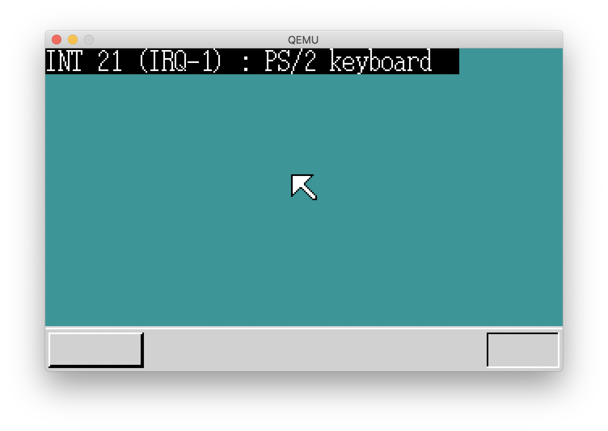


## 7日目 FIFOとマウス制御
### キーコードを取得しよう
- harib04a
- 割り込みハンドラを修正する
    - 割り込みを受けたことをPICに通知するようにする。
    - 割り込みハンドラーでキーコードを取得する
- 上記を行うと以下のようになる。

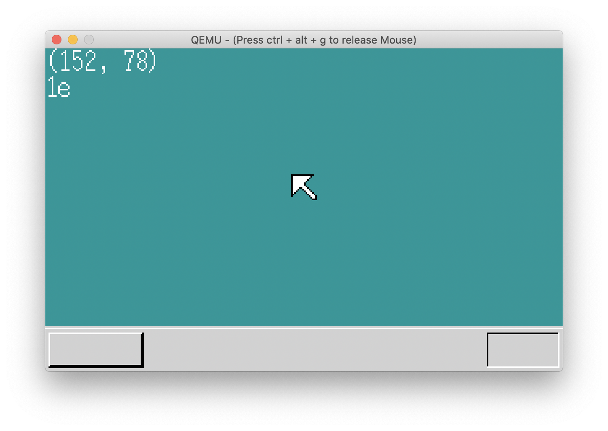

### 割り込み処理は手早く
- harib04b
- 割り込み処理の中で描画処理をやっていることをHariMainに移す
  - 割り込み処理はできるだけ軽量に書く
  - キーボードの入力を保存するバッファを用意し、HariMainで読み出すように修正する。
- これを実行すると、キーボードの押したときと離したときで2バイト目のコードが送られない状態になる。(次の節でこれを修正する)


### FIFOバッファを作る
- harib04c
- `pic.h`のキーバッファの定義を修正し、FIFOバッファとして利用できるように変更をする


### FIFOバッファを改良する
- harib04d
- harib04cで作ったFIFOバッファを改良し、リングバッファとして再実装。

### FIFOバッファを整理する
- harib04e
- FIFOの実装を独立したクラスとして実装

### さぁマウスだ
- harib04f
- マウス制御回路とマウスを初期化して、マウスの割り込みイベントを有効化する

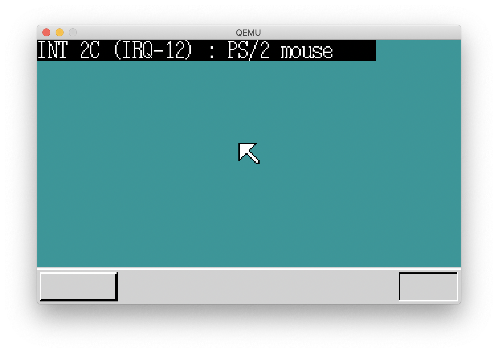

### マウスからのデータ受信
- harib04g
- マウスのデータをFIFOで取り込むようにし、`bootpack.c`でキーボードと一緒に表示するように変更

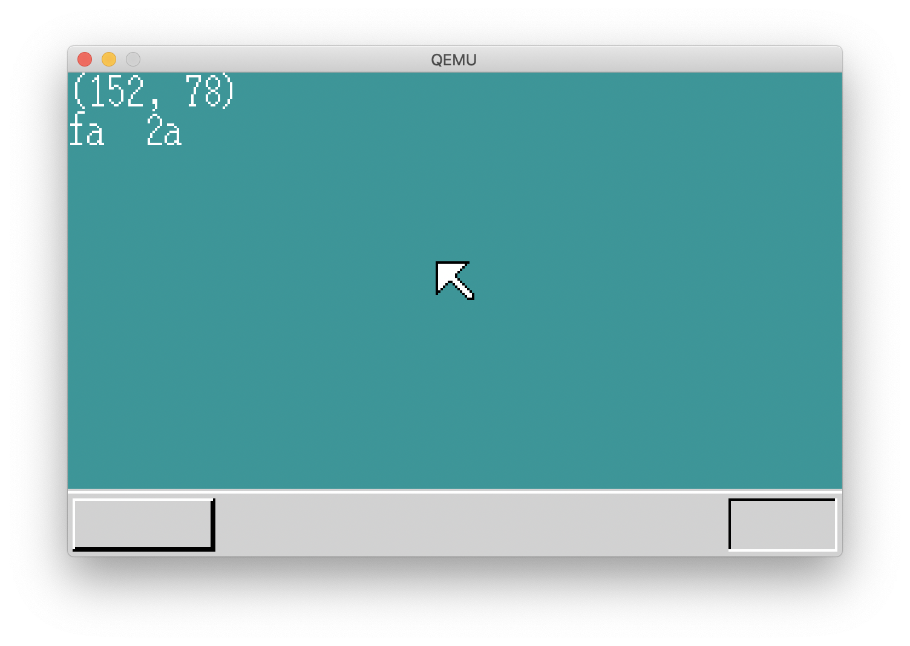

とりあえずマウスの初期化とデータ取得まで終わったー。


## 8日目 マウス制御と32ビットモードの切り替え

### マウスの解読
- harib05a
- マウスのマウスの入力を画面上に表示するようにする
  - マウスのデータは3バイト
    - 1バイト目・・・マウスクリックの情報
    - 2バイト目・・・横の動き
    - 3バイト目・・・縦の動き
- これを画面上に数値を表示すると次のようになる。

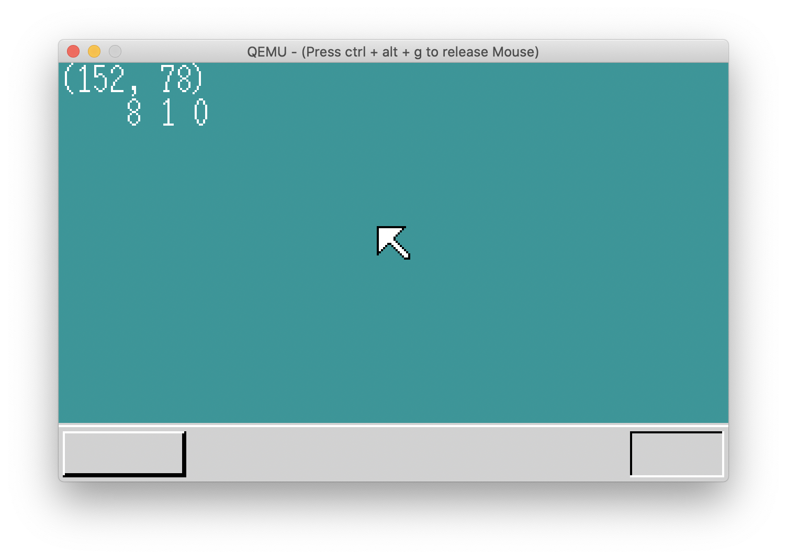


### ちょっと整理
- harib05b
- マウス周りのコードを構造体や関数などに整理

### マウスの解読（2）
- harib05c
- マウスの解読処理を改善
    - マウスのデコード処理の改善したので、表示部も修正。
    - マウスの移動方向によって負数になるので、sprintfのコードを修正
       - 早く`libc`ポーティングしたい
- とりあえずここまでの表示対応ができたものが以下。

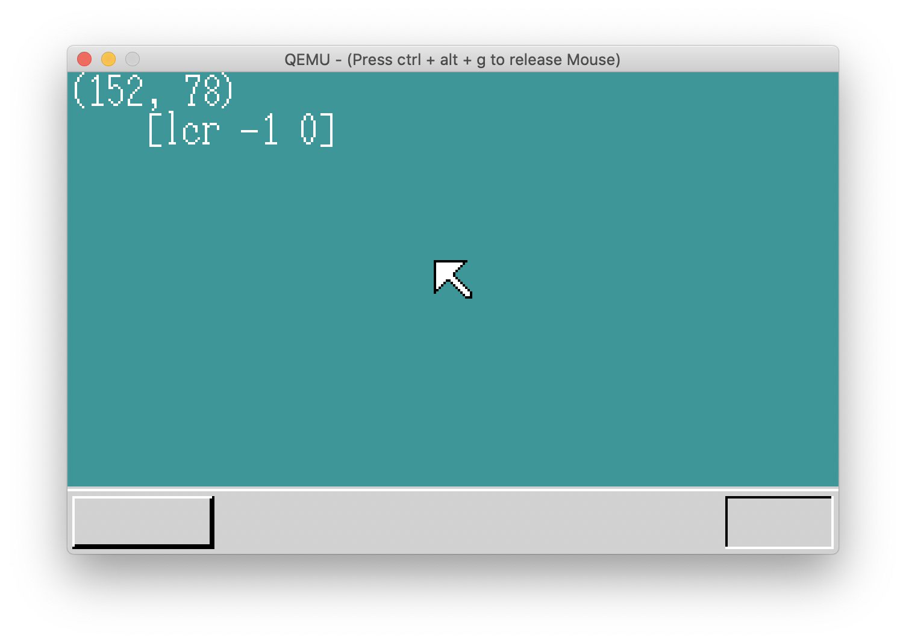

### 動けマウス
- harib05c
- マウスの解読処理ができたのでこれにあわせてマウスが動くように調整する
- マウスが動くようになるとできたなってー錯覚する

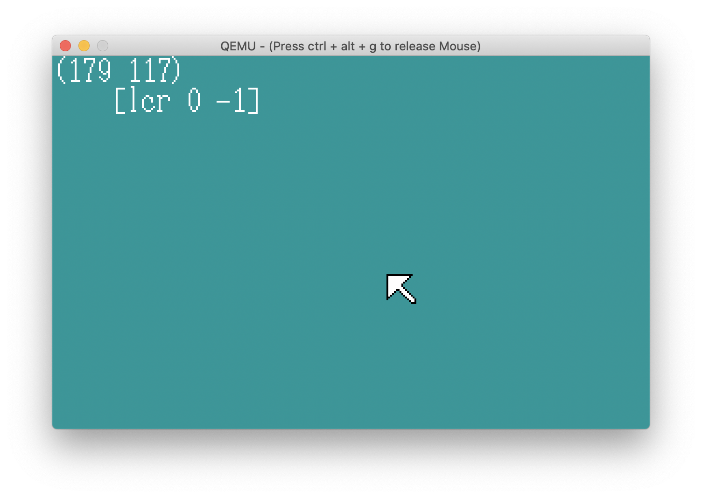

### 32bitモード
- asmhead.nasの解説
- CPUモードの切替中は、割り込みが来ると困るので一旦割り込みを全部禁止している。
- A20信号線は1MB以上のメモリの使用制限を解除するための信号線でキーボードコントローラとつながっている。キーボードコントローラーに0xdfを送るとこれがオフになり、1MB以上のメモリを使用することができるようになる。
- INSTRSET命令は、386以降のキーワードを有効にするための命令(EAXとかCR0)
   - CR0はOS以外触ってはいけない
   - CR0レジスタに最上位ビットを0最下位ビットを1に設定することで、「ページングを使わないプロテクトモード」に切り替わる
   - プロテクモードへ変更後、CPUの命令の解釈が変わるのでJMPを実行する
      - パイプライン処理に影響が出るため
- bootpackの転送はメモリマップ上にデータを転送している(C言語のmecpy的なもの)
- waitkbdoutは、wait_KBC_sendreadyとほぼ同じ。`IN AL 0x60` 
- ALIGNB命令は、16の倍数になるまでDB 0で埋める命令。ALIGNを8の倍数で揃えておかないとMOV命令が遅くなる。
- GDTOというのは、てきとうなGDTです。0番はヌルセレクタで、セグメントを定義することができない。GDTROは、LGDT命令でGDTOにGDTがあるよ、と知らせるためのものになっている

```
これでasmhead.nasの説明は終わりです。つまり最初の状態では、GDTはasmhead.nasの中にあ
って、OxOO270000-OxOO27ffffになっていなかったわけです。IDTは設定すらしていません。だ
から割り込み禁止のままになっています。ハードウェアがいろいろなデータを溜め込んで不具合を起こ
さないうちに、早く割り込みを受け付けられるようにするべきです。
そんなわけで、bootpack.cのHariMainでは、パレットの初期化や画面の準備よりも先に、とにかく
急いでGDTとIDTを作り直して、PICも初期化して、io_sti();しています。
```

8章終わり。次からはメモリ管理

## 9日目 メモリ管理

### ソースの整理
- bootpack.h/bootpack.cに書いていたマウスとキーボードの処理をそれぞれ独立したファイルにする
  - `keyboard.c` `keyboard.h` `mouse.c` `mouse.h`
- ついでにディレクトリ構造を変更しMakefileのルールを変更した
- ディレクトリ構造は次の通り

```sh
$ tree
├── Makefile
├── build
├── out
└── src
    ├── asm
    │   ├── asmhead.nas
    │   ├── hrb.ld
    │   ├── ipl10.nas
    │   └── naskfunc.nas
    ├── assets
    │   └── hankaku.txt
    ├── bootpack.c
    ├── bootpack.h
    ├── descriptors.c
    ├── descriptors.h
    ├── fifo.c
    ├── fifo.h
    ├── graphic.c
    ├── graphic.h
    ├── keyboard.c
    ├── keyboard.h
    ├── mouse.c
    ├── mouse.h
    ├── my_sprintf.c
    ├── my_sprintf.h
    ├── pic.c
    └── pic.h
```

- src直下に`.c`ファイル、src/asm以下に`.nas`ファイル及び`.ld`ファイル、src/assets以下に`hankaku.txt`を置いた
- ディレクトリ構造を変更すると次のようにリンカが`_binary_hankaku_bin_start`がないとエラーをはくので調べると`hankaku.o`のエントリ名に、中間ファイル出力先パスが追加されていた
  - OxEDでfont.oのバイナリの中を調べた。リンカまわりのデバッグは辛い

```
/usr/local/Cellar/i386-elf-gcc/9.2.0/lib/gcc/i386-elf/9.2.0/../../../../i386-elf/bin/ld: bootpack.c:(.text+0x8c): undefined reference to `init_mouse'
/usr/local/Cellar/i386-elf-gcc/9.2.0/lib/gcc/i386-elf/9.2.0/../../../../i386-elf/bin/ld: bootpack.c:(.text+0x174): undefined reference to `enable_mouse'
/usr/local/Cellar/i386-elf-gcc/9.2.0/lib/gcc/i386-elf/9.2.0/../../../../i386-elf/bin/ld: bootpack.c:(.text+0x21d): undefined reference to `decode_mouse'
/usr/local/Cellar/i386-elf-gcc/9.2.0/lib/gcc/i386-elf/9.2.0/../../../../i386-elf/bin/ld: build/graphic.o: in function `putfont8_asc':
graphic.c:(.text+0x446): undefined reference to `_binary_hankaku_bin_start'
```

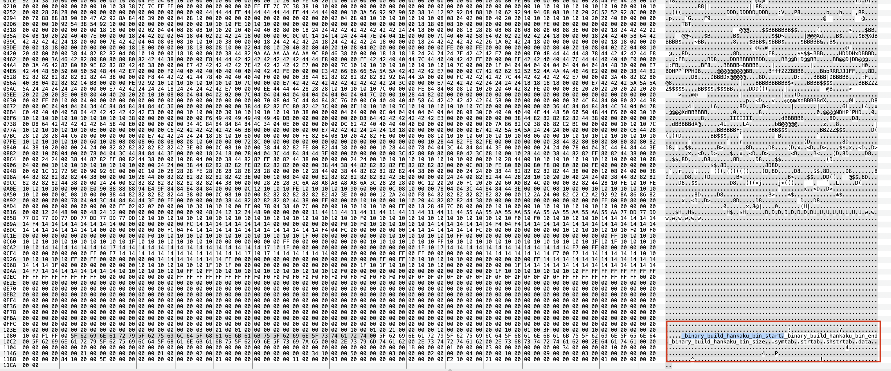

- フォントデータのエントリ名を新しい名前に差し替えてビルドすると08日の実行結果が再現できたのでソース整理は完了

### メモリ容量チェック
- harib06b / harib06c
- メモリテストの関数`memtest`と`memtest_sub`を作成
- 486系チップは、キャッシュレジスタがあるので、486系のときキャッシュを無効にできるよう、キャッシュレジスタへの書き込みと読み込みを行う関数をアセンブリで追加
- プログラムをコンパイルして、実行すると128MBと表示された
   - 本書では3072MBと表示されることになっている。
   - harib06cはこれを修正

- 128MBはqemuのデフォルトのメモリ容量ではなかろうかと考え、`-m`オプションで __32M__ を指定してやると 32MBと表示された。

```sh
	qemu-system-i386 -drive file=$(OUTDIR)haribote.img,format=raw,if=floppy -boot a -m 2048M
```

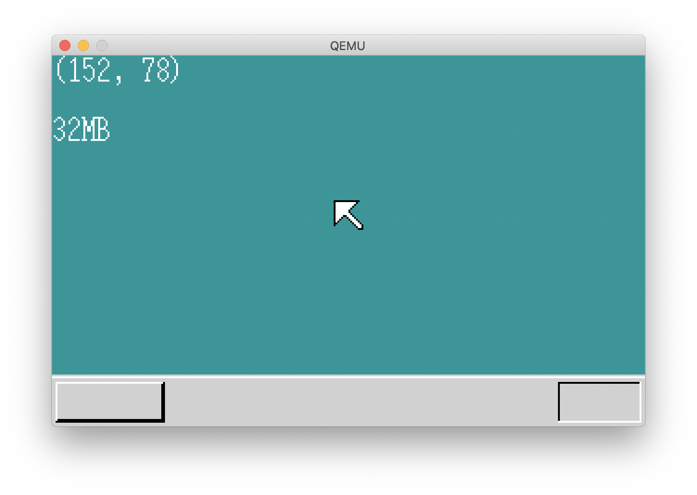


- 同様に、`-m`オプションで __2048M__ を指定してやると 2048MBと表示された。


```sh
	qemu-system-i386 -drive file=$(OUTDIR)haribote.img,format=raw,if=floppy -boot a -m 2048M
```

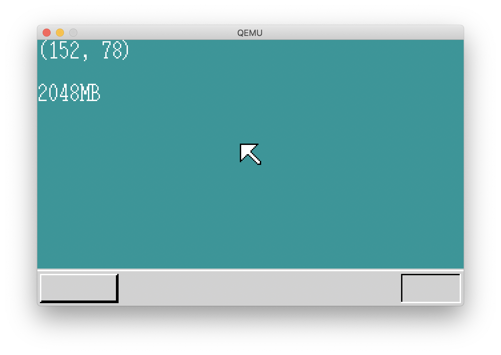

上記の実行結果からこれでおそらく正常に動作しているのではないかと思う。本書ではztoolsとWindowsの環境を想定しているが、実行環境はmacOSとqemuおよびi386-elf-gccなのでコンパイル時に施される最適化の違い（オプションの違いかも）からこの様になっているものだと思う。

次の章は、最適化による不具合の修正なので、次の節はスキップする（読むだけ）

### メモリ管理に挑戦
- harib06d
- メモリ管理のコードを`memory.h`と`memory.c`に分離した。
  - メモリ解放処理・メモリ確保処理を追加
- メモリテストのサブルーチン`memtest_sub`をアセンブリに移動

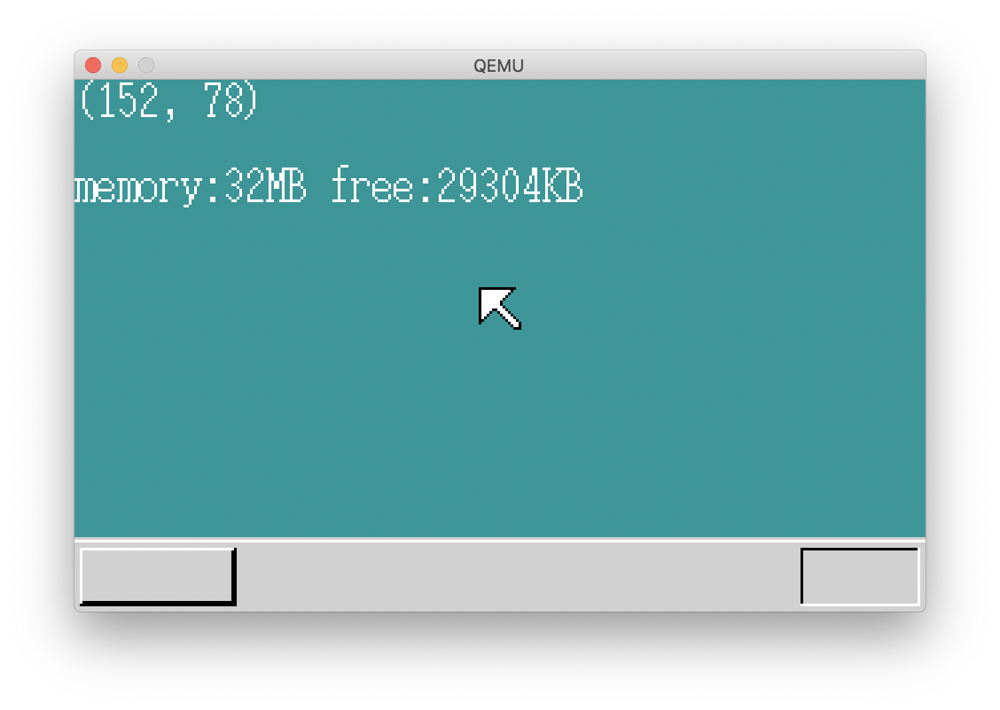

本書の期待どおりの出力が確認できた。

## 10日目 重ね合わせ処理
### メモリ管理の続き
- メモリ管理を1バイト単位ではなく、4KB単位で行う、`memman_free_4k`と`memman_alloc_4k`を実装する。
-  切り上げ・切り捨ての話は、プログラミングの初歩的なテクニックとなるのでスキップした。

### 重ね合わせ処理
- 重ね合わせ処理を行うための関数群を`sheet.h`および`sheet.c`に追加
- 描画方法をsheetへするように`bootpack.c`を修正
- 得られた画像は次のようになる。
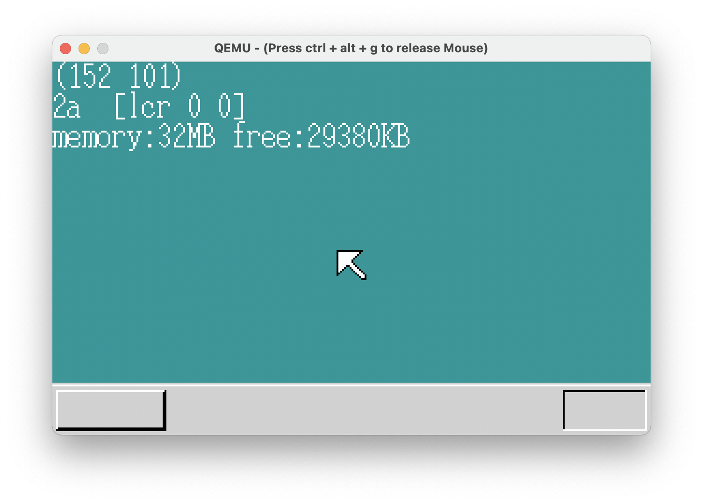

- `sheet_refresh`を改善して描画を高速化。表示内容に変更はないので、画像は省略。

## 11日目 ついにウインドウ
### もっとマウス
- harib08a
- マウスカーソルをを画面外まで移動できるように修正する
- 本書の指示通りに修正をすると、不具合が発生するのでつぎのharib08bで修正をする
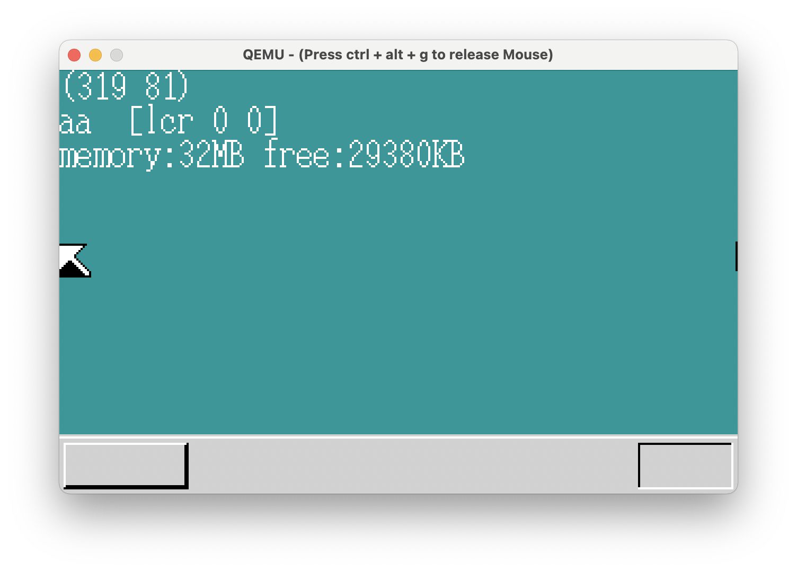

### 画面外サポート
- harib08b
- refreshsub関数を書き換えて、画面街を書き換えないようにする
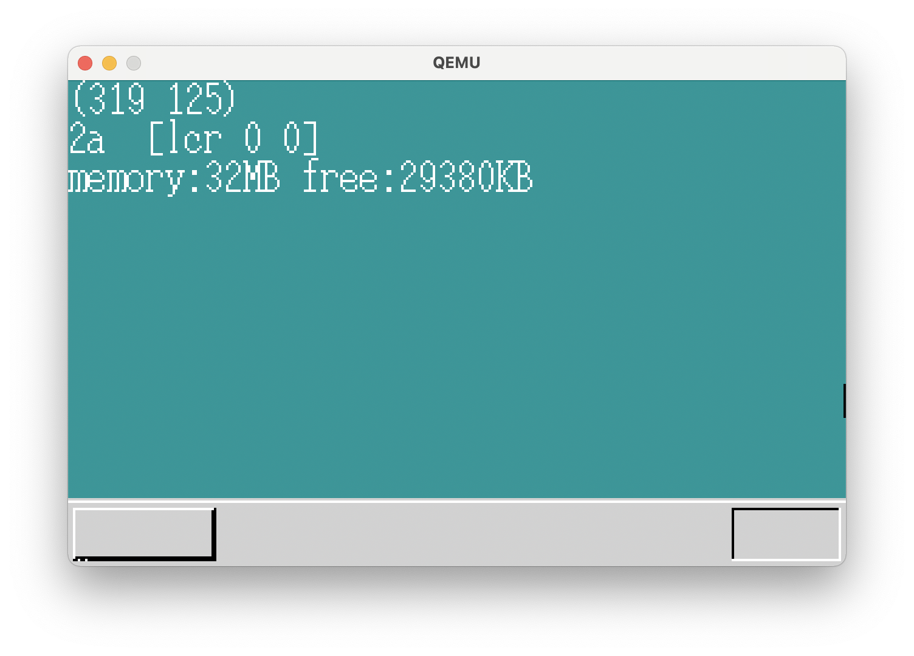

### shtctlの省略してい
- harib08c
- いくつかの関数からshtctlの省略して利用できるようにする。

### ウインドウを出してみよう
- harib08d
- ウインドウを出す。

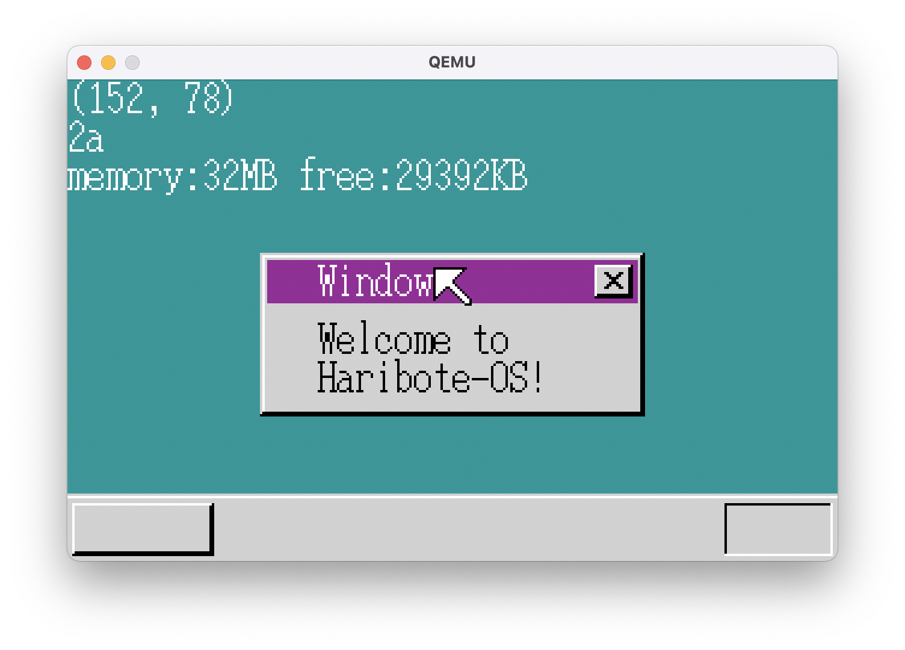

### すこし遊んで見る
- harib08e
- ウインドウとマウスのシートの順序を入れ替えて描画する。

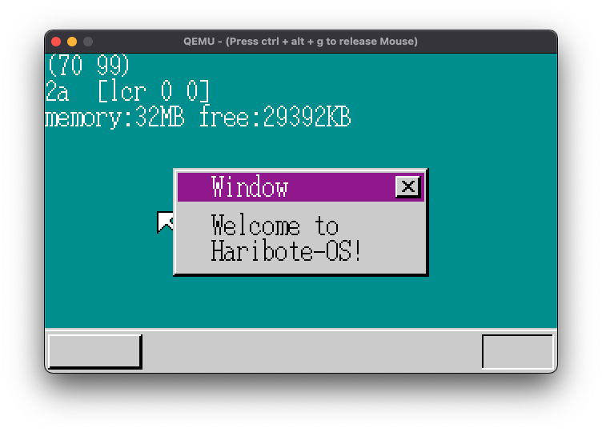

### 高速カウンタだぁ
- harib08f
- カウンタを表示させる。

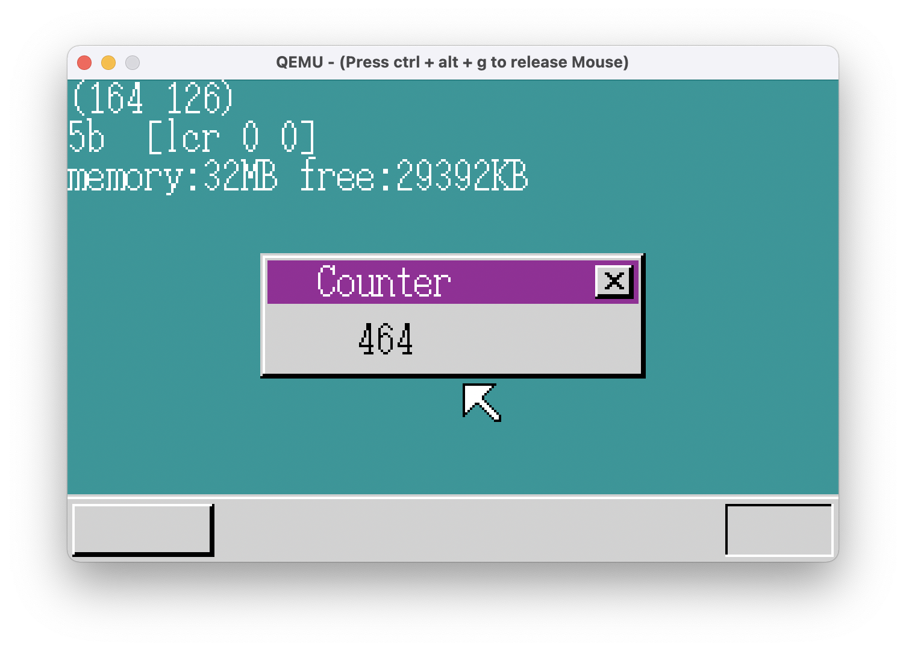

### チラチラ解消（１）
- harib08g
- 見た目に変更はないのでスクショは省略


### チラチラ解消（2）
- harib08h
- 見た目に変更はないのでスクショは省略